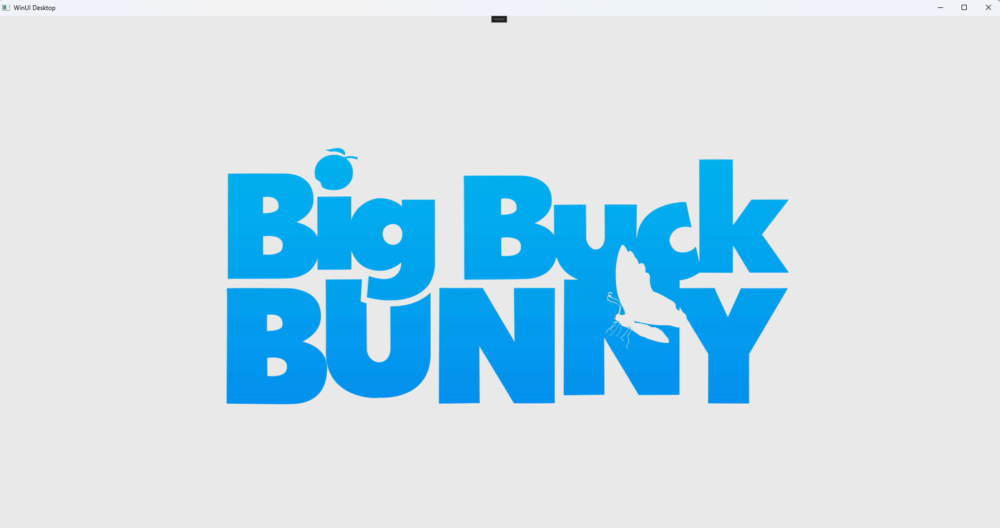
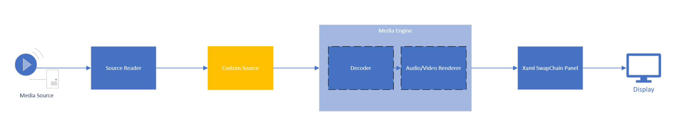

# Overview of Projects
## About
This sample is designed to show an implementation of a Media Foundation pipeline using a XAML swapchain panel and Media Engine with a "Custom Media Source" [MF Custom Source](https://learn.microsoft.com/en-us/windows/win32/medfound/writing-a-custom-media-source).
The custom source will allow greater control in the data passed to Media Engine. Once the source has been instantiated and set, the Media Engine will be able to directly send events and requests for the source to respond.
The main purpose of the custom source and the custom streams of the custom source is to control the samples passed into Media Engine, while also responding to start, seek, pause, stop, and shutdown events.

### How to Build
1. Open MediaEngineCustomSourceXamlSample.sln in Visual Studio 2022 or newer
2. Ensure that the Windows SDK is up to date (Version 17134 or newer) It can be installed here: [Windows SDK](https://developer.microsoft.com/en-us/windows/downloads/windows-sdk/)
3. Install the Windows App SDK if it is not already. It can be installed here: [Win App SDK](https://learn.microsoft.com/en-us/windows/apps/windows-app-sdk/downloads)
4. Build the solution

### How to Run
There are two ways to run the sample. Within Visual Studio, the debug option can be used to run the sample. The sample can also be built into a standalone application that can be launched like a normal application.

### Example Screenshot

### Block Diagram

This is a simplified block diagram for the full project. The [Source Reader](https://learn.microsoft.com/en-us/windows/win32/medfound/source-reader) gets a sample from the source file and decodes it. The sample is then passed to the custom source when the Media Engine requests more samples. The sample goes through the Media Engine pipeline (which typically passes the samples to the audio or video decoders and then the audio or video renders).
During setup, the video renderer will duplicate a composition surface handler which is passed to the XAML swapchain panel. This allows the video renderer in the Media Engine to present to the XAML application.

---
## Media Engine Custom Source XAML Sample
### Overview
Sample app using a XAML swapchain panel, C++/WinRT, and Media Engine to do video playback. This sample uses a source reader to pass samples to a custom source which feeds into the Media Engine pipeline [IMFMediaEngine](https://learn.microsoft.com/en-us/windows/win32/api/mfmediaengine/nn-mfmediaengine-imfmediaengine).

### Files
**App.xaml**: Application entry point. Standard for a simple XAML application.

**MainWindow(.idl, .xaml, .cpp)**: Defines the window and the operations of the application. The .idl file outlines the class interface. The XAML file outlines the UI, this application just features the SwapChainPanel with a StackPanel functioning as an overlay that is used to trigger playback on the loading event.
- *CreateSourceReader*: Handles the creation and setup of the source reader. 
- *InitializeDXGI*: This creates the DXGI device manager and D3D device to pass to source reader and Media Engine.
- *OnPanelLoaded*: Triggered when the overlay panel is loaded. Creates source reader, Media Engine and custom source.
- *SetupVideoVisual*: Called after Media Engine signals pipeline sends MF_MEDIA_ENGINE_EVENT_LOADEDMETADATA [MF Media Engine Events](https://learn.microsoft.com/en-us/windows/win32/api/mfmediaengine/ne-mfmediaengine-mf_media_engine_event). This sets the swap chain panel with a composition surface from Media Engine.
- *OnMediaInitialized* Calls SetupVideoVisual and starts playback.
- *OnPlaybackEnd* Finishes playback when MF_MEDIA_ENGINE_EVENT_ENDED [MF Media Engine Events](https://learn.microsoft.com/en-us/windows/win32/api/mfmediaengine/ne-mfmediaengine-mf_media_engine_event) is sent from Media Engine.

**MediaFoundationHelpers.h**: Helper class for MFPutWorkItem

**MediaEngineExtension(.cpp, .h)**: Class used by Media Engine to notify and load a custom source. [IMFMediaEngineExtension](https://learn.microsoft.com/en-us/windows/win32/api/mfmediaengine/nn-mfmediaengine-imfmediaengineextension)
- *BeginCreateObject*: Called by Media Engine to begin creating custom source. This function will retrieve the locally stored MediaEngineSourceWrapper object. [Media Engine Extension BeginCreateObject](https://learn.microsoft.com/en-us/windows/win32/api/mfmediaengine/nf-mfmediaengine-imfmediaengineextension-begincreateobject)
- *CancelObjectCreation*: Custom source does not implement cancelling creating an object.[IMFMediaEngineExtension CancelObjectCreation](https://learn.microsoft.com/en-us/windows/win32/api/mfmediaengine/nf-mfmediaengine-imfmediaengineextension-cancelobjectcreation)
- *SetMediaSource*: Sets the custom MediaEngineSourceWrapper as the custom source. 
- *EndCreateObject*: Finish creating custom source object. [IMFMediaEngineExtension CancelObjectCreation](https://learn.microsoft.com/en-us/windows/win32/api/mfmediaengine/nf-mfmediaengine-imfmediaengineextension-endcreateobject)
- *Shutdown*: Clear resources on Media Engine shutdown.
- *CanPlayType*: MediaEngineExtension is used to resolve as custom media source for MFMediaEngine, MIME types are not used. [IMFMediaEngineExtension CanPlayType](https://learn.microsoft.com/en-us/windows/win32/api/mfmediaengine/nf-mfmediaengine-imfmediaengineextension-canplaytype)

**MediaEngineWrapper(.cpp, .h)**: Creates a wrapper to Media Engine, and is the main object to interface with Media Engine.
- *RuntimeClassInitialize*: Initialization and calling creating CreateMediaEngine to create the Media Engine object.
- *StartPlayingFrom*: Sets the current playback time for the source reader and Media Engine before calling play. [IMFMediaEngine SetCurrentTime](https://learn.microsoft.com/en-us/windows/win32/api/mfmediaengine/nf-mfmediaengine-imfmediaengine-setcurrenttime), [IMFMediaEngine Play](https://learn.microsoft.com/en-us/windows/win32/api/mfmediaengine/nf-mfmediaengine-imfmediaengine-play)
- *GetSurfaceHandle*: Returns the composition surface, which can be passed to the swap chain panel. [XAML media dxinterop](https://learn.microsoft.com/en-us/windows/win32/api/windows.ui.xaml.media.dxinterop/nf-windows-ui-xaml-media-dxinterop-iswapchainpanelnative2-setswapchainhandle)
- *WindowUpdate*: Updates the Media Engine with the video output width and height. [IMFMediaEngineEx UpdateVideoStream](https://learn.microsoft.com/en-us/windows/win32/api/mfmediaengine/nf-mfmediaengine-imfmediaengineex-updatevideostream)
- *CreateMediaEngine*: Creates MediaEngineExtension object which is used to set custom source, create MediaEngineNotifyImpl object which listens for events from Media Engine, creates Media Engine object, and also creates the MediaFoundationSourceWrapper object which is the custom source that Media Engine will interface with. After source is set, load is called on Media Engine to queue and set topology of the playback.[IMFMediaEngine](https://learn.microsoft.com/en-us/windows/win32/api/mfmediaengine/nn-mfmediaengine-imfmediaengine)
- *OnLoaded*: Call back from MF_MEDIA_ENGINE_EVENT_LOADEDMETADATA [MF Media Engine Events](https://learn.microsoft.com/en-us/windows/win32/api/mfmediaengine/ne-mfmediaengine-mf_media_engine_event) in the MediaEngineNotifyImpl object. Once topology is loaded in Media Engine, EnableWindowlessSwapchainMode is set true to enable DCOMP mode and obtain the composition surface handle. This function will also call back to the MainWindow.Xaml.cpp to allow the UI thread to set the composition surface handle.
- *OnError*: Error handling from Media Engine.
- *OnPlaybackEnded*: When playback ends, shutdown Media Engine and associated objects.

**MediaEngineNotifyImpl(.cpp, .h)**: Class to capture callbacks from Media Engine. [IMFMediaEngineNotify](https://learn.microsoft.com/en-us/windows/win32/api/mfmediaengine/nn-mfmediaengine-imfmediaenginenotify)
- *RuntimeClassInitialize*: Initialization.
- *Shutdown*: Shutdown from MediaEngineWrapper object.
- *EventNotify*: Called when Media Engine sends an event, the associated call back function will be used to handle the event. [IMFMediaEngineNotify EventNotify](https://learn.microsoft.com/en-us/windows/win32/api/mfmediaengine/nf-mfmediaengine-imfmediaenginenotify-eventnotify)

**MediaFoundationSourceWrapper(.cpp, .h)**: Custom Source used to handle input samples (in this case, the samples are from the source reader). [IMFMediaSource](https://learn.microsoft.com/en-us/windows/win32/api/mfidl/nn-mfidl-imfmediasource)
- *RuntimeClassInitialize*: Initialization and creating MediaFoundationStreamWrapper objects for Audio and Video in this sample. The Media type is passed from the source reader, which is also used to find the total number of streams available.
- *GetCharacteristics*: Queried by Media Engine object, returns that the custom source is able to seek. [IMFMediaSource GetCharacteristics](https://learn.microsoft.com/en-us/windows/win32/api/mfidl/nf-mfidl-imfmediasource-getcharacteristics)
- *SelectDefaultStreams*: Called from CreatePresentationDescriptor, an audio and a video stream is selected in this example for playback, which is reflected in the PresentationDescriptor.
- *CreatePresentationDescriptor*: Called from Media Engine to initialize playback on the media source. IMFStreamDescriptor are queried to each MediaFoundationStreamWrapper and saved to IMFPresentationDescriptor to pass back to Media Engine. [IMFMediaSource CreatePresentationDescriptor](https://learn.microsoft.com/en-us/windows/win32/api/mfidl/nf-mfidl-imfmediasource-createpresentationdescriptor)
- *Start*: Called by Media Engine to start playback at the source. This function is also called during a seek. The start call is propagated to each selected MediaFoundationStreamWrapper object. The corresponding MESourceStarted/MESourceSeeked event is also sent to Media Engine to notify as response. [IMFMediaSource Start](https://learn.microsoft.com/en-us/windows/win32/api/mfidl/nf-mfidl-imfmediasource-start)
- *Stop*: Called by Media Engine to stop playback at the source. This call is propagated to MediaFoundationStreamWrapper objects and also MESourceStopped. [IMFMediaSource Stop](https://learn.microsoft.com/en-us/windows/win32/api/mfidl/nf-mfidl-imfmediasource-stop)
- *Pause*: Called by Media Engine to pause playback at the source. This call is propagated to MediaFoundationStreamWrapper objects and also MESourcePaused. [IMFMediaSource Pause](https://learn.microsoft.com/en-us/windows/win32/api/mfidl/nf-mfidl-imfmediasource-pause)
- *Shutdown*: Sets state to shutdown. [IMFMediaSource Shutdown](https://learn.microsoft.com/en-us/windows/win32/api/mfidl/nf-mfidl-imfmediasource-shutdown)
- *GetEvent*: Functional implementation of IMFMediaEventGenerator. [IMFMediaEventGenerator GetEvent](https://learn.microsoft.com/en-us/windows/win32/api/mfobjects/nf-mfobjects-imfmediaeventgenerator-getevent)
- *BeginGetEvent*: Functional implementation of IMFMediaEventGenerator. [IMFMediaEventGenerator BeginGetEvent](https://learn.microsoft.com/en-us/windows/win32/api/mfobjects/nf-mfobjects-imfmediaeventgenerator-begingetevent)
- *EndGetEvent*: Functional implementation of IMFMediaEventGenerator. [IMFMediaEventGenerator EndGetEvent](https://learn.microsoft.com/en-us/windows/win32/api/mfobjects/nf-mfobjects-imfmediaeventgenerator-endgetevent)
- *QueueEvent*: Functional implementation of IMFMediaEventGenerator.[IMFMediaEventGenerator QueueEvent](https://learn.microsoft.com/en-us/windows/win32/api/mfobjects/nf-mfobjects-imfmediaeventgenerator-queueevent)
- *GetService*: Functional implementation of IMFGetService. [IMFGetService GetService](https://learn.microsoft.com/en-us/windows/win32/api/mfidl/nn-mfidl-imfgetservice)
- *GetSlowestRate*: Functional implementation of IMFRateSupport. Defaults to the custom source not supporting playback rate in reverse.[IMFRateSupport GetSlowestRate](https://learn.microsoft.com/en-us/windows/win32/api/mfidl/nf-mfidl-imfratesupport-getslowestrate)
- *GetFastestRate*: Functional implementation of IMFRateSupport. Defaults to the custom source not supporting playback rate in reverse. [IMFRateSupport GetFastestRate](https://learn.microsoft.com/en-us/windows/win32/api/mfidl/nf-mfidl-imfratesupport-getfastestrate)
- *IsRateSupported*: Functional implementation of IMFRateSupport. Calls GetSlowestRate and GetFastestRate to check if playback rate is supported. [IMFRateSupport IsRateSupported](https://learn.microsoft.com/en-us/windows/win32/api/mfidl/nf-mfidl-imfratesupport-isratesupported)
- *SetRate*: Functional implementation of IMFRateControl. Sets the given rate from Media Engine if supported and sends MESourceRateChanged as response. [IMFRateControl SetRate](https://learn.microsoft.com/en-us/windows/win32/api/mfidl/nf-mfidl-imfratecontrol-setrate)
- *GetRate*: Functional implementation of IMFRateControl. Returns the current playback rate. [IMFRateControl SetRate](https://learn.microsoft.com/en-us/windows/win32/api/mfidl/nf-mfidl-imfratecontrol-getrate)
- *StreamCount*: Returns the total number of MediaFoundationStreamWrapper objects.
- *CheckForEndOfPresentation*: Checks all media streams have ended, if so, send MEEndOfPresentation to signal to Media Engine that playback has ended.

**MediaFoundationStreamWrapper(.cpp, .h)**: Custom media stream that is controlled by the custom source [IMFMediaStream](https://learn.microsoft.com/en-us/windows/win32/api/mfidl/nn-mfidl-imfmediastream)
- *RuntimeClassInitialize*: Initialization, will call GenerateStreamDescriptor and MFCreateEventQueue to generate the stream descriptor for Media Engine and Event queue object to send stream events.
- *GetMediaSource*: Returns the Source object. [IMFMediaStream GetMediaSource](https://learn.microsoft.com/en-us/windows/win32/api/mfidl/nf-mfidl-imfmediastream-getmediasource)
- *GetStreamDescriptor*: return the stream descriptor for Media Engine initialization. [IMFMediaStream GetStreamDescriptor](https://learn.microsoft.com/en-us/windows/win32/api/mfidl/nf-mfidl-imfmediastream-getstreamdescriptor)
- *RequestSample*: Called when Media Engine requests a sample from the stream. This function will use the passed in source reader to read a sample and send it to Media Engine. If the stream ends, then a MEEndOfStream is sent. [IMFMediaStream RequestSample](https://learn.microsoft.com/en-us/windows/win32/api/mfidl/nf-mfidl-imfmediastream-requestsample)
- *StreamType*: Returns the type of stream (Audio, Video).
- *GetEvent*: Functional implementation of IMFMediaEventGenerator.[IMFMediaEventGenerator GetEvent](https://learn.microsoft.com/en-us/windows/win32/api/mfobjects/nf-mfobjects-imfmediaeventgenerator-getevent)
- *BeginGetEvent*: Functional implementation of IMFMediaEventGenerator. [IMFMediaEventGenerator BeginGetEvent](https://learn.microsoft.com/en-us/windows/win32/api/mfobjects/nf-mfobjects-imfmediaeventgenerator-begingetevent)
- *EndGetEvent*: Functional implementation of IMFMediaEventGenerator. [IMFMediaEventGenerator EndGetEvent](https://learn.microsoft.com/en-us/windows/win32/api/mfobjects/nf-mfobjects-imfmediaeventgenerator-endgetevent)
- *QueueEvent*: Functional implementation of IMFMediaEventGenerator. [IMFMediaEventGenerator QueueEvent](https://learn.microsoft.com/en-us/windows/win32/api/mfobjects/nf-mfobjects-imfmediaeventgenerator-queueevent)
- *GenerateStreamDescriptor*: Creates a stream descriptor based on the media type. Used in Media Engine initialization.
- *GetMediaType*: Returns the media type found in the source reader (eg. codec, audio/video, and other detaisl)
- *QueueStartedEvent*: Sends MEStreamStarted event for when source received a start from Media Engine.
- *QueueSeekedEvent*: Sends MEStreamSeeked event for when source received a seek from Media Engine.
- *QueueStoppedEvent*: Sends MEStreamSeeked event for when source received a stop from Media Engine.
- *QueuePausedEvent*: Sends MEStreamSeeked event for when source received a pause from Media Engine.
- *SetSelected*: Returns if this stream is selected for the current playback.
- *HasEnded*: Returns if this stream has ended.