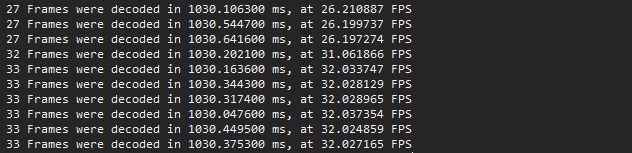
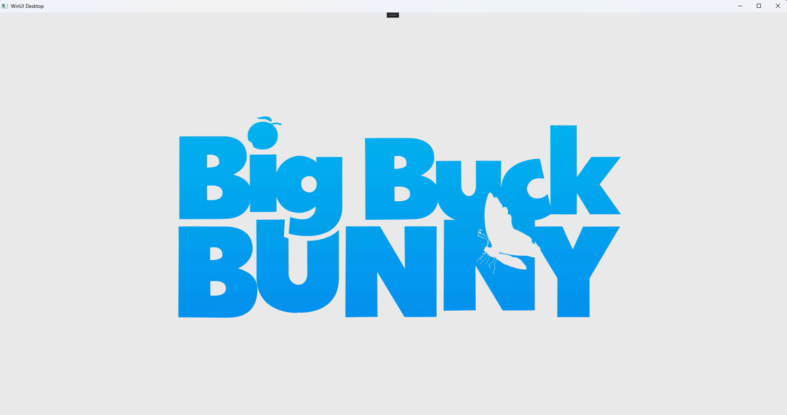
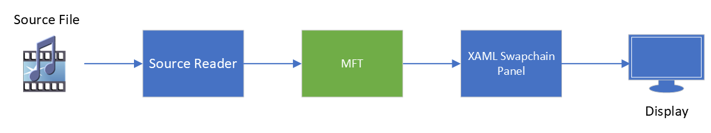

# Overview of Projects
## About
This selection of samples is designed to show an implementation of a media pipeline using a XAML swapchain panel. The addition of the MFT in subsequent projects gives an outline of how an MFT might be used in these scenarios. MFTs have a wide range of uses from decoding to ML effects on video frames.
### How to Build
1. Open XAMLSamples.sln in Visual Studio 2022 or newer
2. Ensure that the Windows SDK is up to date (Version 17134 or newer) It can be installed here: [Windows SDK](https://developer.microsoft.com/en-us/windows/downloads/windows-sdk/)
3. Install the Windows App SDK if it is not already. It can be installed here: [Win App SDK](https://learn.microsoft.com/en-us/windows/apps/windows-app-sdk/downloads)
4. Build the solution

### How to Run
There are two ways to run the sample. Within Visual Studio, the debug option can be used to run the sample. The sample is also be built into a standalone application that can be launched like a normal application. When run there are fps statics that can be viewed in the debug output terminal.

### Example Screenshot

When run, the applicaiton will open a WinUI Desktop window that will automatically start playback of the Big Buck Bunny source video. The window can be moved and resized, but the video itself will stay the same size in the window.

### Block Diagram

This is a simplified block diagram for the full project. The [Source Reader](https://learn.microsoft.com/en-us/windows/win32/medfound/source-reader) gets a sample from the source file and decodes it. The sample is then passed to the MFT, which functions as a passthrough, before being given to the swapchain to present on the screen.
In the case of the *XAML SAMPLE* the MFT is removed from the pipeline and the Source Reader passes a sample directly to the swapchain.

---
## XAML Sample
### Overview
Sample app using a XAML swapchain panel, C++/WinRT, and D3D to do video playback. This sample does not feature an MFT, just a source reader to pass samples to the swapchain panel for presentation. This sample is the basis for the other samples in this project.

### Files
**App.xaml**: Application entry point. Standard for a simple XAML application.

**MainWindow(.idl, .xaml, .cpp)**: Defines the window and the operations of the application. The bulk of the code is in these files. The .idl file outlines the class interface. The XAML file outlines the UI, this application just features the SwapChainPanel with a StackPanel functioning as an overlay that is used to trigger playback on the loading event.
- *CreateSourceReader*: Handles the creation and setup of the source reader. 
- *ReadUnCompressedSample*: Reads the next sample from the source and assign it to a buffer
- *OnPanelLoaded*: Triggered when the overlay panel is loaded. Starts playback on a separate thread using MFPutWorkItem.
- *InitializeGraphics*: Creates a D3D device and swapchain for composition to assign to the XAML swapchainPanel
- *InitializeVideoProcessor*: Setup input and output information for the VPBlt operation.
- *DoPresentationLoop*: Main function of playback. Initializes components, then frame by frame will present to the swapchain panel until the end of stream is reached. Calculates statistics for fps periodically as well.

**Util.h**: Helper class for MFPutWorkItem

---
## Basic MFT (Class)
### Overview
Barebones example of a synchronous MFT. Functions as a passthrough for the sample from input to output. Builds as a static library for other projects in the solution to use.

For more information on the IMFTransform interface view the docs here: [IMFTransform](https://learn.microsoft.com/en-us/windows/win32/api/mftransform/nn-mftransform-imftransform)
### Files
**BasicMFT.cpp**: Implementation of the IMFTransform interface. Defines GUID to be used to instantiate the MFT from a dll.
- *ProcessInput*: Caches the sample to be used as output
- *ProcessOutput*: Makes a copy of the cached sample to the output
- *GetInputStreamInfo*: Sets `MFT_INPUT_STREAM_PROCESSES_IN_PLACE`
- *GetOutputStreamInfo*: Sets `MFT_OUTPUT_STREAM_PROVIDES_SAMPLES`

---
## Basic MFT (DLL)
### Overview
Builds a dll for the BasicMFT class.

### Files
**dllmain.cpp**: Defines the entry into the dll application. Defines the function used to create instances of the contained classes. 
- `CoCreateableClass`: Defines the class factory for the BasicMFT class
- `DllGetClassObject`: Exposes the call to the WRL GetClassObject method to get the defined factory 

**BasicMFT.def**: Details the exported functions exposed by the dll and the name of the associated Library.

---
## XAML Sample with MFT (Class)
### Overview
Builds off the XAML Sample and gives an example of how to add an MFT to the pipeline by directly instantiating an instance of the MFT class. The only changes in this project are in the MainWindow class.
### Files
**MainWindow.cpp**: Added functionality for MFT usage.
- *InitializeMFT*: Calls make to get an instance of the BasicMFT class. Gets the current media type from the source reader and then sets that type on the MFT. Sets the output type on the MFT, then sends the message to the MFT that streaming is beginning.
 - *DriveMFT*: This function handles manually driving the MFT in a synchronous manner. It checks for a ready output sample, will pass input if needed, then check again for output until it is available. There is some extra handling there that will account for a difference in the presence or absence of `MFT_OUTPUT_STREAM_PROVIDES_SAMPLES`.

---
## XAML Sample with MFT (DLL)
### Overview
Builds on the MFT (Class) sample and expands to include loading the MFT from the DLL built in the BasicMFTDll project. It also shows how to instatiate and use it in the application's pipeline. The only changes in this project are in the MainWindow Class, and an extra post-build event to copy the MFT dll to an accessible folder.

### Files
**MainWindow.cpp**: Added functionality for loading the MFT from a dll
- *LoadMftFromDll*: Uses the defined dll name (kMFTDllName) to load the dll and hold a reference to it in a global (g_mftModule). From the module, the defined GUID (CLSID_BasicMFTDLL) from the BasicMFTClass definition is used to get the classFactory of that type from the dll. The factory is used to create an instance of the MFT and pass it back to the caller.