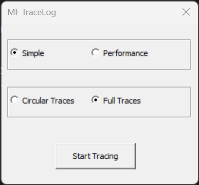

# Media Foundation tracing
There are various tools and scripts to capture Media Foundation (MF) traces. Following sections provide information on the recommended tools/scripts and steps to capture MF traces for specific scenarios.   

## Application/Browser Video Playback Scenarios

Follow these steps to capture traces and other related information.

1. Download  
    - Download **mftracelog.zip** from [https://github.com/microsoft/media-foundation/releases/latest](https://github.com/microsoft/media-foundation/releases/latest)
    - Unzip the downloaded file to obtain mftracelog.exe for x86, arm64 and amd64 platforms
    - Identify your machine's platform (amd64, x86, arm64) and open the corresponding folder   
2. Start tracing and reproduce the issue
    - Close all instances of the video playback application/browser involved. 
    - Launch mftracelog.exe by double-clicking on the file in File Explorer
    - Select **Simple** and **Full Traces** radio button in the mftracelog.exe UI as shown below. 
      
        
      
    - click **Start Tracing** button. 
    - Reproduce the issue. Try to capture the repro in less than 2 minutes if possible to avoid large trace file.
3. Stop tracing:
    - Click **Stop Tracing** button.  
    - This will generate several output files. File Explorer will automatically open to show all the files. 
    - Select all  files and select **"compress to zip file"** through right-click menu to create a zip file  
4. Share the zip file 
  

## Video Playback Performance Scenarios 

For performance scenarios, select the **Performance** and **Full Traces** radio button in the mftracelog.exe UI and follow instructions as mentioned above. Performance traces can produce very large trace files so try to keep the capture to less than 2 minutes.

Optionally, you can also capture traces using command window. See [section](../performanceTracing/README.md) for more information.

